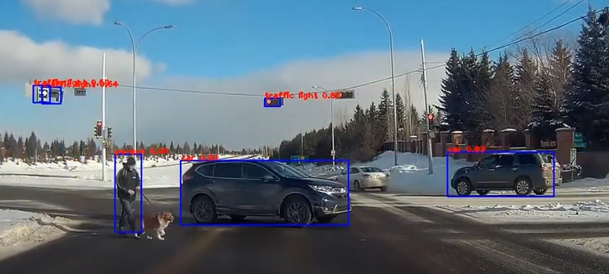
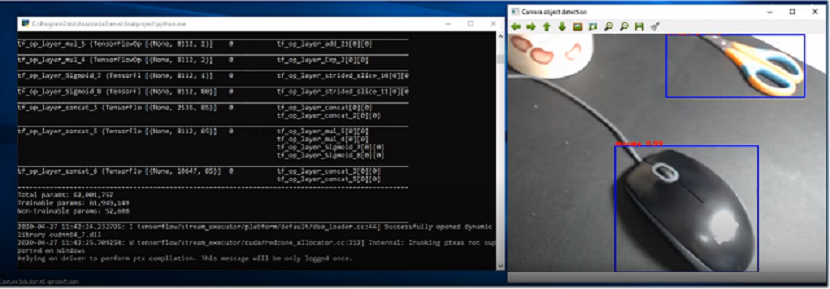

# YOLOv3 Tensorflow

Here's the image output example:


Here's the video output example:
[](https://youtu.be/7O721Zt6wE8)

Here's the camera output example:
[](https://youtu.be/GHK44tlMlcA)


-
This project is a Python base tool to demonstrate Object Detecion by YOLO v3.

Installation
-
Getting the tool to work is simple, download/clone the package, unzip the package and go to the ObjectDetection-master folder and then run the following command:

```
step 1
Create Virtual Environment
    conda create -n yolov3 python=3.7

    conda activate yolov3

step 2
Install the requirements packages
(yolov3)$ pip install -r requirement.txt


step 3
[Download data and weights zip file here](https://drive.google.com/drive/folders/100SOPwtUrVMT2vXKzS-NyQHc56Cob-cf) and unzip copy to the same folders.

you are ready to go!
```

System Structure
-


    .
    ├─ .vs                                       # Visual Studio files
    ├─ cfg
    │     ├── yolov2-voc.cfg                     # YOLO2 VOC  dataset config file
    │     └── yolov3.cfg                         # YOLO3 COCO dataset config file
    ├── core
    │     ├── utils.py                           # utils
    │     └── yolov3.py                          # YOLOv3 tensorflow model file
    ├── data 
    │     ├───── images                          # imput image files
    │     │         ├── demo.jpg               
    │     │         ├── demo1.jpg              
    │     │         ├── demo2.jpg              
    │     │         └── dog.jpg 
    │     ├── coco.names                         # YOLO3 coco dataset class file 
    │     └── voc.names                          # YOLO3 VOC dataset class file 
    ├── weights
    │     ├── yolov2-voc.weights                 # YOLO VOC dataset pre-train weight file                       
    │     ├── yolov2-voc.weights.tf.data-00000-of-00002
    │     ├── yolov2-voc.weights.tf.data-00001-of-00002
    │     ├── yolov2-voc.weights.tf.index        # Tensorflow format YOLO VOC weight file
    │     ├── yolov3.weights                     # YOLO COCO dataset pre-train weight file                        
    │     ├── yolov3_weights.tf.data-00000-of-00002
    │     ├── yolov3_weights.tf.data-00001-of-00002
    │     ├── yolov3_weights.tf.index            # Tensorflow format YOLO COCO weight file
    │     └── note.txt                           
    ├── result                                   # video/image object detaction result folder  
    │     ├── 2019_0224_112436_312_result.mp4    
    │     └── Image_detection.png
    ├─ README.md
	├─ camera_yolo.py                            # Object Detaction by camera
	├─ video_yolo.py                             # Object Detaction by video file
	├─ image_yolo.py                             # Object Detaction by image file
	├─ transform_weights.py                      # Transform YOLO weight file to tensorform format
	├─ requirements.txt                          # Install requirement list
    ├─ SECURITY.md                               # github SECURITY file
	├─ Image_detection.png                       # README image Object Detaction Result DEMO
    └─ LICENSE                                   # License 

Version
-
0.0.1 

Team Member
-
Zhouning Ma(ZM11)

License
-
Apache License


Reference
-
*  (1) official yolov3 implementation  https://github.com/pjreddie/darknet
*  (2) Ayoosh Kathuria https://blog.paperspace.com/how-to-implement-a-yolo-object-detector-in-pytorch/
*  (3) YunYang1994  https://github.com/YunYang1994/tensorflow-yolov3
*  (4) jaskarannagi19 https://github.com/jaskarannagi19/yolov3
*  (5) RahmadSadli  https://mc.ai/the-beginners-guide-to-implementing-yolo-v3-in-tensorflow-2-0-part-1/
*  (6) Yonge Street Toronto https://www.google.com/url?sa=i&url=https%3A%2F%2Fwww.blogto.com%2Fcity%2F2019%2F10%2Fyonge-street-toronto-car-free%2F&psig=AOvVaw1pDPfTAoazYPXOL_2ix-7K&ust=1588103171806000&source=images&cd=vfe&ved=0CAIQjRxqFwoTCLDtoL6viekCFQAAAAAdAAAAABAD
