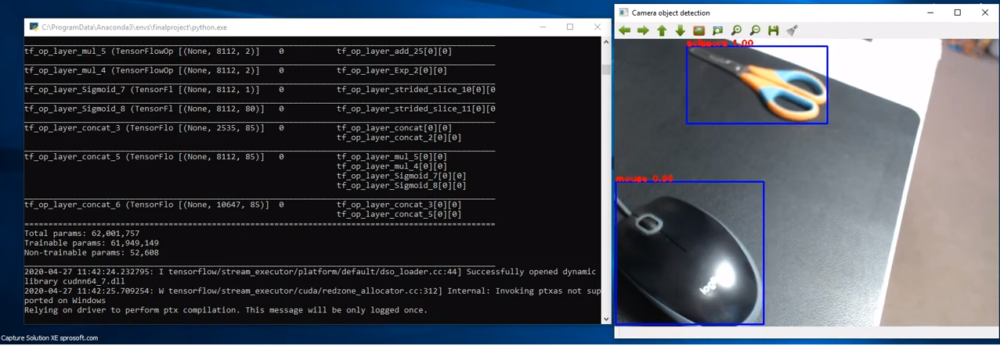

# YOLOv3 Tensorflow

Introduction
-
This project is a Python base tool to demonstrate Object Detecion by YOLO v3 on Windows Envirenment.

Here's the image output example:

Here's the video output example:

Here's the camera output example:

Installation
-
Getting the tool to work is simple, download/clone the package, unzip the package and go to the ObjectDetection-master folder and then run the following command:

step 1
Install nVIDIA GPU driver(you need a nVIDIA Video card)

step 2
Install CUDA and cuDNN

     download CUDA v10.0 and install

     download cuDNN v7.6.4 for CUDA 10.0
     unzip and copy to CUDA folder

step 3
Create Virtual Environment

    conda create -n yolov3 python=3.7

    conda activate yolov3

step 4
Install the requirements packages

    (yolov3)$ pip install -r requirements.txt 
    
        or if you meet permission issue, try the following:
    
    (yolov3)$ pip install -r requirements.txt --user 

step 5
[Download source here]:
    https://drive.google.com/drive/folders/100SOPwtUrVMT2vXKzS-NyQHc56Cob-cf

    Code + Data:  ObjectDetection.zip

    or

    Data only: ObjectDetectionData.zip

     unzip the file and copy to the same folders.

you are ready to go!

Usage
-
Image Object detection

     python image_yolo.py

Video Object detection

     python video_yolo.py

Camera Object detection

     python camera_yolo.py

System Structure
-

    .
    ├─ .vs                                       # Visual Studio files
    ├─ cfg
    │     ├── yolov2-voc.cfg                     # YOLO2 VOC  dataset config file
    │     └── yolov3.cfg                         # YOLO3 COCO dataset config file
    ├── core
    │     ├── utils.py                           # utils
    │     └── yolov3.py                          # YOLOv3 tensorflow model file
    ├── data 
    │     ├───── images                          # imput image files
    │     │         ├── demo.jpg               
    │     │         ├── demo1.jpg              
    │     │         ├── demo2.jpg              
    │     │         └── dog.jpg 
    │     ├───── videoes                          # imput video files
    │     │         ├── 2019_0224_130349_315.MP4
    │     │         ├── 2019_0224_112436_312.MP4
    │     │         └── DashCamTest.mp4
    │     ├── coco.names                         # YOLO3 coco dataset class file 
    │     └── voc.names                          # YOLO3 VOC dataset class file 
    ├── weights
    │     ├── yolov2-voc.weights                 # YOLO VOC dataset pre-train weight file                       
    │     ├── yolov2-voc.weights.tf.data-00000-of-00002
    │     ├── yolov2-voc.weights.tf.data-00001-of-00002
    │     ├── yolov2-voc.weights.tf.index        # Tensorflow format YOLO VOC weight file
    │     ├── yolov3.weights                     # YOLO COCO dataset pre-train weight file                        
    │     ├── yolov3_weights.tf.data-00000-of-00002
    │     ├── yolov3_weights.tf.data-00001-of-00002
    │     ├── yolov3_weights.tf.index            # Tensorflow format YOLO COCO weight file
    │     └── note.txt                           
    ├── result                                   # video/image object detaction result folder  
    │     ├── 2019_0224_112436_312_result.mp4    
    │     └── Image_detection.png
    ├─ README.md
	├─ camera_yolo.py                            # Object Detaction by camera
	├─ video_yolo.py                             # Object Detaction by video file
	├─ image_yolo.py                             # Object Detaction by image file
	├─ transform_weights.py                      # Transform YOLO weight file to tensorform format
	├─ requirements.txt                          # Install requirement list
    ├─ SECURITY.md                               # github SECURITY file
	├─ Image_detection.png                       # README image Object Detaction Result DEMO
    └─ LICENSE                                   # License 

Version
-
0.0.1 

Team Member
-
Zhouning Ma(ZM11)

License
-
Apache License

Reference
-
*  (1) Pascal VOC Dataset  https://pjreddie.com/projects/pascal-voc-dataset-mirror/
*  (2) COCO Dataset: http://cocodataset.org/#overview
*  (3) AYOOSH KATHURIA, How to implement a YOLO (v3) object detector from scratch https://blog.paperspace.com/how-to-implement-a-yolo-object-detector-in-pytorch/
*  (4) YunYang1994 https://github.com/YunYang1994/tensorflow-yolov3
*  (5) YOLOv3 official site: https://pjreddie.com/darknet/yolo/
*  (6) zzh8829/yolv3-tf2,TF YOLO V3 Object Detection in TensorFlow 2.0 http://datahacker.rs/tensorflow2-0-yolov3/
*  (7) Joseph Redmon,YOLOv3: An Incremental Improvement https://pjreddie.com/media/files/papers/YOLOv3.pdf
*  (8) Dae-Hwan Kim,Evaluation of COCO Validation 2017 Dataset with YOLOv3 http://www.jmest.org/wp-content/uploads/JMESTN42352998.pdf
*  (9) Honathan Hui, Real-time Object Detection with YOLO, YOLO2 and now YOLOv3, section “YOLOv3 performance”  https://medium.com/@jonathan_hui/real-time-object-detection-with-yolo-yolov2-28b1b93e2088
*  (10) Yonge Street Toronto https://www.google.com/url?sa=i&url=https%3A%2F%2Fwww.blogto.com%2Fcity%2F2019%2F10%2Fyonge-street-toronto-car-free%2F&psig=AOvVaw1pDPfTAoazYPXOL_2ix-7K&ust=1588103171806000&source=images&cd=vfe&ved=0CAIQjRxqFwoTCLDtoL6viekCFQAAAAAdAAAAABAD
 